#Отчет о лабораторной работе №6
#Яснева Марина гр.4916

###Ход работы:
На GitHub'е сделала копию https://github.com/Kurtyanik/LR6/

С помощью команды cd Desktop/laba6 в консоли Git Bash переша в созданную на рабочем столе папку laba6

Использовала команду git init чтобы инициализировать гит в данной папке

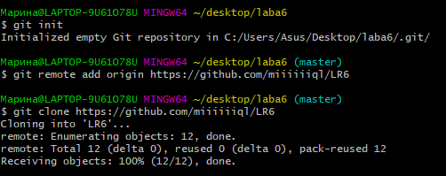

Командой git remote add origin связала папку с удалённым репозиторием на сайте GitHub

Затем через графический интерфейс GitHub добавила новый файл file.txt в удалённый репозиторий и добавила его в ветку master

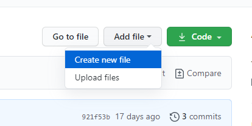

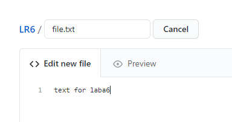

Пользуясь командой git pull origin master загрузила изменения из удалённого репозитория в локальный

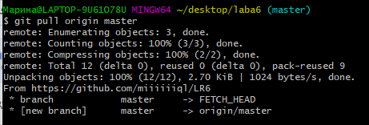

Командой git log получила список операций/коммитов

Используя git show получила более подробную информацию по последнему изменению

Командой _git checkout -t branch1_ переключилась на другую ветку branch

Попыталась выполнить слияние веток master и branch1 командой git merge branch1 и получила ошибку

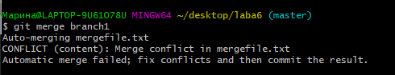

Вручную изменила файл mergefile.txt, вызвавший ошибку слияния, и выполнила коммит

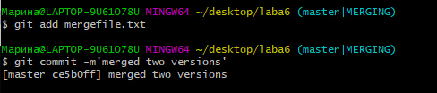

Выполнила слияние веток master и branch1 а затем удалила ветку branch1 

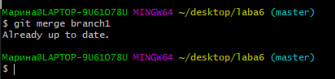

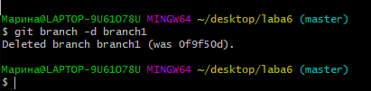

Запушила всё в удалённый репозиторий командой git push origin master 

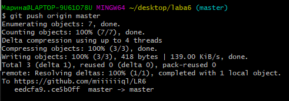

Затем сделала несколько изменений, создала новые файлы

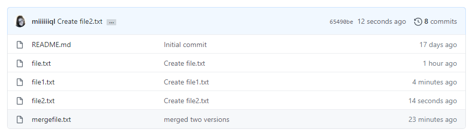

Командой git reset --hard HEAD~1 выполнила откат последнего коммита 

Запушила изменённую ветку

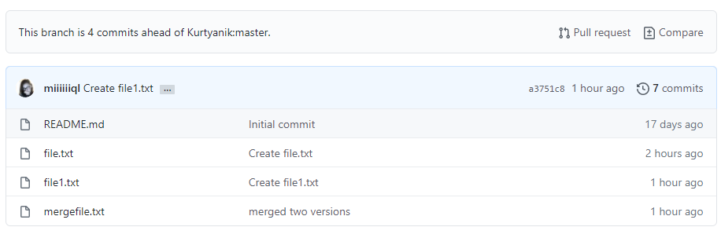

Пользуясь командой git checkout -b report создала новую ветку report

Текущая история git log --graph. Аргумент --graph позволяет графически изобразить ветки и коммиты на них

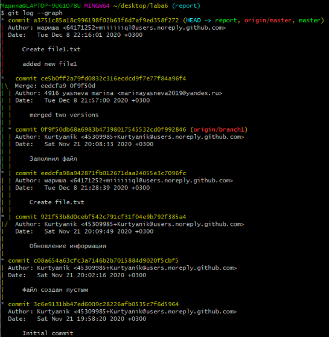

С помощью команды git add . подготовила все новые файлы в папке laba6 к пушу

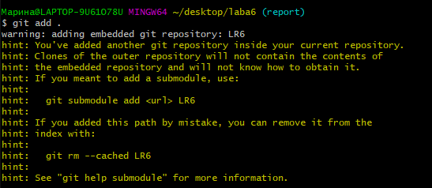

Запушила файлы скриншотов в удалённый репозиторий

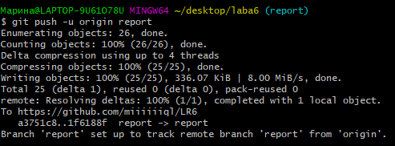

Оформление отчёта в файле README.md, используя блокнот

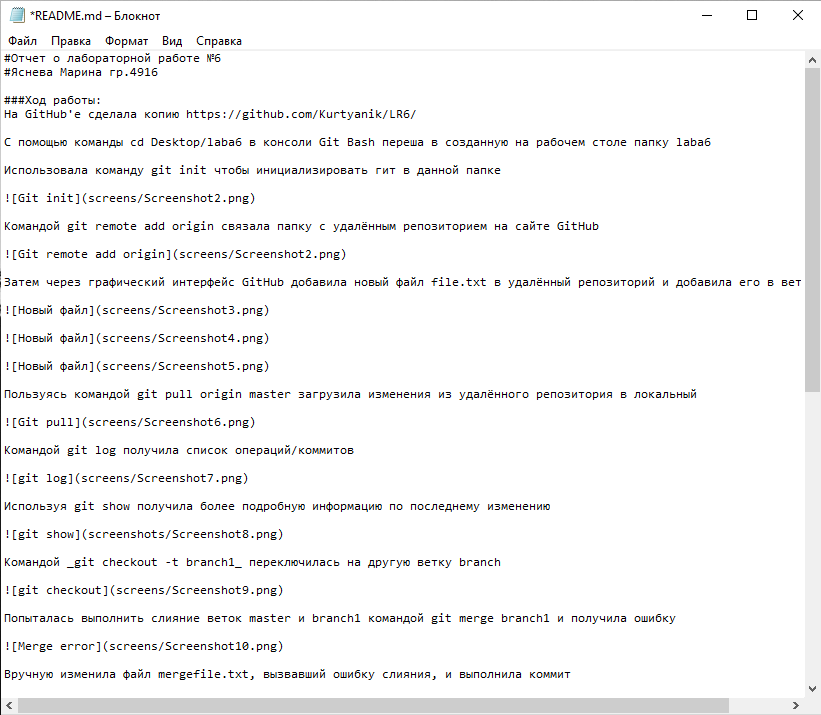

Лог команд из папки .git/logs

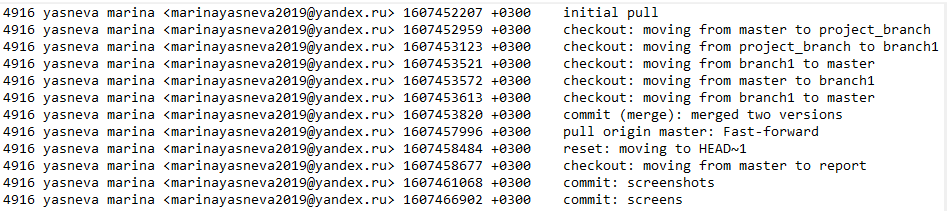

Финальный результат команды git log

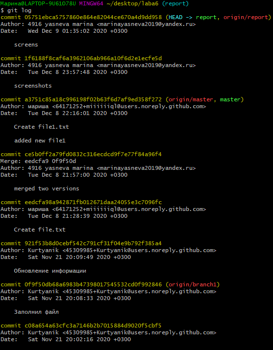

Все файлы скриншотов лежат в папке screens